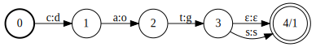
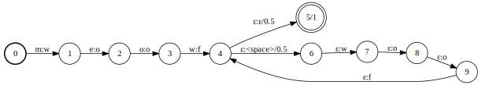
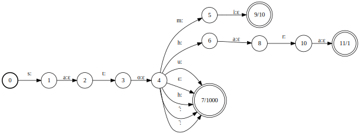

# 問題

scouty の XX です。
本記事では、
自然言語処理におけるクラシックな手法である有限状態トランスデューサとその使い方を紹介します。

scouty はインターネット上のオープンデータを解析して
エンジニアと最適な企業をマッチングすることで
ミスマッチを解除する抱負を抱えています。
インタネット上のオープンデータを解析するのには
非構造データに構造を与える大きなチャレンジがあります。
非構造データといえば、
複合部分が区別されていない
名前の文字列は簡単な例です。
名前の文字列が非構造データだったら構造化データは何でしょう？
世界中の名前を一つの構造化表現に収めることは難しいでしょうが、
「性と名」は日本語の名前を表現するのに十分だと思われます。
このプロジェクトの趣旨は
非構造データの文字列を「性と名」の構造化表現に変換することで,
面白い部分は
ローマ字化された日本語の名前を扱うことです。

ローマ字化された名前なら
文字列のスペースを見れば楽勝だと思うかもしれませんが、
性と名の曖昧な順番はその楽勝を防ぎます。
一方では日本語の習慣はもちろん性と名をその順番で書く、
他方では西洋の習慣はその逆ですね。
場合によってインタネットで見つかった
ローマ字化された日本人の名前は
両方の順番を使うことがあります。
この名前を適切に扱うための第一歩は
どれが名字とどれが下の名前という判断を行うことです。

日本人の名字は十万種 [1](#f1)
よりもありますが、
二万種の名字の累積頻度は人口の 99% 強に及びます。
[2](#f3)
全ての名字には情報がなくても
人気のある名字には
頻度や読み方や色々な情報が
十分にあります。
それに違って
下の名前には情報がわりに乏しいです。
(more explanation on data difference...)
データの量がそんなに違う以上
姓と名を分類するというより
名字を検知するという方針で行くことになりました。
理想的な手法ではなくても、
1.0 に十分な効果をもたらすと思います。
本記事で扱うデータ処理は基本的に統計的であって、
人口の数パーセントに対応できなくても
システムの運用に貢献できます。

## ローマ字逆変換

名字のデータベースを使うために
ローマ字の逆変換を行う必要があります。
なぜならば、
名字のデータベースが常に二つの形式を収納している：
漢字とふりがなとです。
ローマ字の文字列とふりがなをマッチングするために
ローマ字からカタカナへ字訳します。
ローマ字の字訳は難しくないはずですが、
変換式が複数にあって、
マクロンを省略するのような
正式な式にはない不規則な書き方が多い
要素を考えなければなりません。
その変換式の混乱に対応できる
既存のライブラリ
を見つけられなかったから
scouty 特有で名字のローマ字逆変換を専門とするライブラリ
を開発しました。

名字をローマ字化する際に
ふりがなだけじゃなくて
漢字も考慮しなくてはならないゆえに
ローマ字をふりがなへ変換するという手法には
対応できないケースがあります。
「石井」という名字と「井椎」という名前を比べましょう。
両方は「イシイ」のふりがなを持つが
訓令式で「石井」は「Ishii」と「井椎」は「Ishî」に変換されます。
ヘボン式の可能性を踏まえて「Ishii」はどれにも一致するが、
他方では「Ishî」は「石井」に一致しません。
本記事の手法はこの問題点に対応しません。
まず、
曖昧なケースが客観的に多くないと思われて、
対応できない曖昧さの一因を考えれば
主観的に動じるには当たりません。
それに加えて
解決が必要とするデータ [3](#f6)
が手元にはないゆえに
この問題を解決するコースパーが良くないです。
データ解析でこのようなコースパー計算を行うのが大事です。

# 有限状態トランスデューサ

有限状態トランスデューサとは
自然言語処理における
テクストの正規化や
品詞分類や
色々なタスクに
活躍した手法である。
よく知られている有限状態機械（または有限オートマトン）
の亜種みたいなものです。
特徴は遷移の際に
入力をとるだけじゃなくて
出力もする事ができるのです。
ーつの記号からなる言語から
他の言語へ変換する機能を持ちます。
一つの入力の記号列が、場合によって、次のようになりえる：
* 出力なし：機械が受容しなかったら
* 一つの出力：記号列にたいして決定的であったら
* ２つ以上の出力：記号列にたいして非決定的であったら

非決定性をもって曖昧な入力に対して複数の結果を出力できる特質は
上に述べた曖昧なローマ字化に節操で対応できることが大きです。
やはり
「記号からなる言語から他の言語へ変換」とは
字訳にぴったりです。
有限状態トランスデューサライブラリの
[OpenFst](http://www.openfst.org/twiki/bin/view/FST/WebHome)
を使います。

以下の変換を行う有限状態トランスデューサ:
* `cat` -> `dog`
* `cats` -> `dogs`

遷移には入力の言語の記号と出力の言語の記号がついていて、
その記号は入力から読めば出力される記号という仕組みです。
しかし、
`ε` が特別な
「何も読まない」か「何も出力しない」
という意味を持つ記号です。

以下の変換を行う有限状態トランスデューサ:
* `dog` -> {`wolf`, `wolves`}

合成することができる性質は
有限状態トランスデューサの便利な特徴です。
以下の有限状態トランスデューサは２つの上記の合成です：
* `cat` -> {`wolf`, `wolves`}

重み付き有限状態トランスデューサは
遷移が重みを含みます。
以下の有限状態トランスデューサは
`meow` を次の出力に変換します：
* `woof`, 重み： 1/2
* `woof woof`, 重み： 1/4
* `woof woof woof`, 重み： 1/8
* など

# 手法

開発した手法は合成有限状態トランスデューサといくつかのヒューリスティックを使います。
その合成有限状態トランスデューサには
字訳機と
語彙知識をもつアクセプタ [4](#f5)
の合成です。
今回、語彙知識とは
どんな名字があると各名字の頻度ということです。

## 字訳機

字訳機の大まかな戦略はローマ字列から
語彙知識を無視すれば全てのありえるカタカナ列を生成することです。
例として、
`シンイチ` のカタカナをヘボン式でローマ字化したら理想的に `Shin'ichi` になりますが、
実践でよく `Shinichi` になってしまいます。それで `シニチ` とかぶって曖昧なケースの誕生です。
以下のトランスデューサは次の変換を行います：
* `Shinichi` -> {`シンイチ`, `シニチ`}
* `Shin'ichi` -> `シンイチ`

今の所、
字訳の遷移に重みを付けませんがパーフォーマンスを上げたかったら
字訳について経験的なデータを遷移の重みとしてトランスデューサに組み込む事が可能です。
つまり、
`ni` が 75% の確率で `ニ` に変換するべきとわかったら
次の様な変換を行うトランスデューサを書くことができます：
* `Shinichi` -> {(`シンイチ`, .25), (`シニチ`, .75)}
* `Shin'ichi` -> (`シンイチ`, 1)

## 語彙知識

字訳機だけで
日本語に見えるかどうかの判断ができますが、
それだけで足りません。
語彙知識を使って字訳機の出力を絞って重みを付けます。
一番人気の約一万の名字には頻度データがあって、
その約一万に含まない名字も考慮すべく
数万の「最低限に一回ある」名字の集合を作ります。
この語彙知識アクセプタを字訳機に合成することで
ローマ字をとってカタカナと重みの組の可能性集合を出力するトランスデューサの出来上がりです。

以下のアクセプタは
{`サトウ`, `サトミ`, `サトハラ`} が存在して、
とその頻度は 1000, 10, 1 だというデータを表します。

字訳機と上記のアクセプタの合成：

## ヒューリスティック

ローマ字化された名前の曖昧を避けるために
名字を全部大文字で書くことがありますね。
その観測をヒューリスティックとしてシステムに組み込みます。
その他の例として、
scouty が取れたデータで
一つの名前が頭文字のケースの大半で
頭文字にされた名前は下の名前だという観測を含みます。
完全の機械学習にならなくても
より広いデータを解析して
字訳の経験的な強化と
こういうヒューリスティックを開発する
改善の可能性があります。

# オープンソースパッケージ

`myouji-kenchi` というパッケージを作ってオープンソースして PyPI に投稿しました。
[Github](https://github.com/scouty-inc/myouji-kenchi)
[PyPI](https://pypi.org/project/myouji-kenchi/)
お試しください。

## 脚注

<b id="f1">1</b>: https://myoji-yurai.net/ この値のために「違う」の定義は漢字かふりがなのどちらでもが違う [↩](#a1)

<b id="f3">2</b>: 比較として、アメリカの2010年国勢調査で二百万種類の名前は人口の 99% に及びませんでした
[↩](#a3)

<b id="f6">3</b>: ふりがなと漢字のアラインメントが必要なのです。
アラインメントとは関係のある2つの文字列でどの文字がどの文字に該当する情報である [↩](#a6)

<b id="f5">4</b>: アクセプタとは入力を授与すれば入力と同じな出力を生成するトランスデューサである [↩](#a5)

