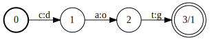
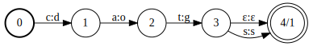
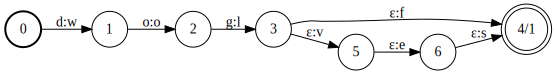
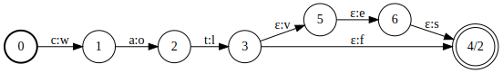
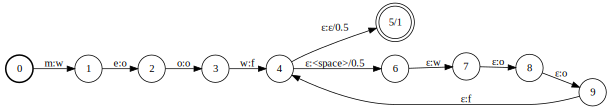
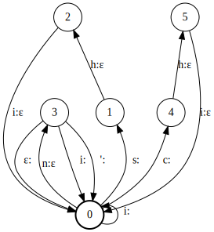
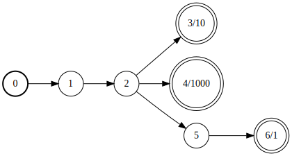
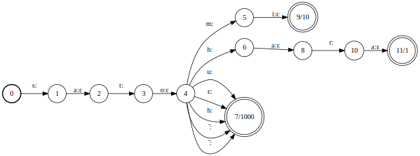

This is Derick Anderson, a Machine Learning Intern at scouty Inc. 
This article discusses a recent project using Finite State Transducers
to create structured representations from romanized Japanese names.

# Background

scouty has the goal of "elminating the mismatch from the world",
in pursuit of which we run a service to optimally match engineers with companies
based on integrating heterogeneous open data from around the Internet.
As part of that service
we provide a means for companies to contact candidates by email.
However,
due to privacy considerations we cannot necessarily show the candidate's name
to our clients on first contact -
if the client wishes to address the candidate they write `Mr. LAST_NAME`
and we fill in the name automatically.
Because of this automatic process
we need the first\_name and last\_name fields in our database to reflect
the candidates actual first and last names.

One of the big challenges of integrating data 
from a variety of sources on the Internet
is dealing with unstructured information.
In this case,
names represented as strings are unstructured information 
that we need to convert into a structured representation.
A structured representation that covered
the whole variety of naming conventions in the world
would be staggeringly complex, 
but for the purposes of handling Japanese names, 
we can assume that names consist of one family name and one given name.
The Japanese language convention is to order names `family name` `given name`,
and we assume that Japanese names written in Japanese follow this convention.
However,
an issue arises when we find a romanized Japanese name,
i.e. a Japanese name written in Latin characters.
The Western convention is of course to write names `given name` `family name`,
and Japanese people follow this convention when romanizing their names - sometimes.
Depending on the individual,
and on the context of where we found the name,
a romanized Japanese name could really be in either order.

# Problem Statement

While more than one hundred thousand 
Japanese family names have been confirmed to exist [1](#f1),
only twenty thousand family names
cover more than ninety nine percent of Japanese people
[2](#f2) [3](#f3).
Luckily,
there is a lot of data available about the frequency of individual family names.
The situation with personal names is less tractable,
in that there are more personal names extant,
and new ones can be created at will.
The data coverage is therefore understandably less thorough.
Because of this data difference it was decided to treat the problem as
picking which of two names is more likely to be a family name.
That is obviously not a perfect formulation,
but we judged it sufficient to get to a 1.0.

## Reversing Romanization

Data available about Japanese names 
naturally records at least two pieces of information,
the text of a name used in normal writing,
and the furigana, i.e. phonetic characters used to write how a name is read.
Furigana alone is not enough to determine the romanization of a name [4](#f4),
but for our purposes it is sufficient to convert romanizations to furigana.
An issue arises however,
in that there are several romanization schemes in active use today,
and in practice names are often romanized omitting
the marks and accents prescribed by the official schemes.
We could not find an existing library that could handle converting
potentially ambiguous romanized strings 
to Japanese phonetic characters,
and so resolved to write one ourselves.
For this project we decided to target the 
(Modified) Hepburn, Kunrei-shiki, and Nihon-shiki romanization schemes,
as well as some common variations on those schemes (e.g. omitting accents).

# Finite State Transducers

The finite state transducer (FST) is a venerable tool 
that has found a lot of use in natural language processing 
for tasks from string normalization to part of speech tagging.
Essentially, they are finite state machines
that can produce output when they transition between states.
The below text assumes a basic knowledge of finite state machines;
for a quick review the [Wikipedia article](https://en.wikipedia.org/wiki/Finite-state_machine)
covers the topic well.

On a theoretical level FSTs translate between two "languages" of symbols,
where any one input can result in:
* zero outputs, if the transducer does not accept an input
* one output, if the transducer is deterministic for an input
* many outputs, if the transducer is non-deterministic for an input

Translating between two languages of symbols is a perfect match to transliteration,
and the ability to produce multiple outputs
is a principled way to handle ambiguity that might be present.

## Some examples

First,
a fundamental example:

The above FST translates `cat` to `dog`.
The symbol on the left of the colon 
represents the input necessary for a transition,
in the same vein as a standard finite state automaton.
The symbol on the right of the colon
represents the output associated with a transition.
The terminal state is represented by a double circle,
which the machine must reach in order to accept,
i.e. to produce any output at all.

An FST that performs the following translations:
* `cat` -> `dog`
* `cats` -> `dogs`

`ε` is a special symbol, epsilon, 
which means that the arc can be taken by the transducer 
without reading input (if there is an epsilon on the input side)
and/or writing output (if there is an epsilon on the output side).

An FST that performs the following translation:
* `dog` -> {`wolf`, `wolves`}

One good quality of FSTs is that they naturally compose together.
The below FST is the composition of the two above 
and it performs the translation:
* `cat` -> {`wolf`, `wolves`}

A final useful quality of FSTs is that 
they can have weights on their arcs or final states.
The following FST translates `meow` to:
* `woof`, with weight 1/2
* `woof woof`, with weight 1/4
* `woof woof woof`, with weight 1/8
* etc.

# Our Solution

To order two names we combine some heuristics
with a finite state transducer responsible for 
evaluating the likelihood strings are romanized Japanese family names.

## FST

The transducer consists of two modules which are composed together,
a transliterator responsible for 
translating between Latin characters and furigana,
and an acceptor [5](#f5) responsible for 
injecting into the process lexical knowledge,
i.e. empirical knowledge about the use of language.

We make use of the performant and expressive library
[OpenFst](http://www.openfst.org/twiki/bin/view/FST/WebHome).

### Transliterator

The general strategy of the transliterator
is to utilize FSTs potential for nondeterminism
to generate all katakana strings theoretically possible.
As mentioned above, 
one common deviation from the Hepburn standard of romanization 
is the omission of apostrophes.
Ideally, 
we could be sure that the furigana `シンイチ` would be romanized to `Shin'ichi`
and `シニチ` would be romanized to `Shinichi`,
but in practice there is ambiguity.
The following piece of a transliterator does the translations:
* `Shinichi` -> {`シンイチ`, `シニチ`}
* `Shin'ichi` -> `シンイチ`

For now we do not distinguish
the likelihood of different translations between characters,
but it would be possible to bake in empirical data about romanization
such that transliterations should be returned with likelihood scores.
That is to say,
if we found that in names seventy five percent of the time `ni`
should be transliterated to `ニ` and twenty five percent of the time to `ンイ`
we could write a transliterator to do a mapping:
* `Shinichi` -> {(`シンイチ`, .25), (`シニチ`, .75)}
* `Shin'ichi` -> (`シンイチ`, 1)

### Lexical Data

Just using the transliterator alone is not enough,
we need to incorporate lexical knowledge 
in order to distinguish what merely looks like romanized Japanese 
from what actually could be a family name.
We combine two sources of data: 
relatively fine grained frequency information 
for about ten thousand of the most popular family names,
and a list of a few tens of thousand 
attested (i.e. known to exist at least once) family names.
We store the whole set of recognized names in an acceptor,
taking advantage of terminal state weights to store frequency information.
By composing this second module onto the transliterator,
we create an integrated system that takes in strings of Latin characters 
and returns potential Japanese strings with weights.

The below acceptor represents the lexical knowledge that the names
サトウ, サトミ, and サトハラ exist,
and with frequencies 1000, 10, and 1 respectively.

The below image is the transliterator composed with the above acceptor:

## Heuristics

In order to reduce the potential for ambiguity in romanized Japanese names,
some writers take the approach of writing the family name in all capital letters.
Where one of the two names we are trying to order is in all capitals
we assume that that name is the family name.
Furthermore,
in our data,
we find that in names where one name is an initial it is very likely that
the initialized name is the given name.
Some more research might be useful to determine 
if this observation is particular to our data,
or true generally about Japanese writing in English.
These two heuristics resolve a lot of ambiguity all on their own,
but there is still plenty of room for the rest of the algorithm to work.

# Open Source Package

We decided to open source the myouji-kenchi package 
under a MIT License.
You can find the project code 
[on Github](https://github.com/scouty-inc/myouji-kenchi)
and releases available for installation 
[on PyPI](https://pypi.org/project/myouji-kenchi/).

## Footnotes

<b id="f1">1</b>: https://myoji-yurai.net/ The definition of distinct for family names
varies based on the source of data and the context of the discussion. For the
purpose of the one hundred thousand number, a name is counted as distinct from
another if either the preferred writing or the pronunciation are at all
different. [↩](#a1)

<b id="f2">2</b>: http://www.orsj.or.jp/\~archive/pdf/bul/Vol.23_06_357.pdf [↩](#a2)

<b id="f3">3</b>: For comparison,
although the United States is perhaps unusually diverse,
in the 2010 census more than two million surnames 
fail to cover ninety nine percent of Americans.
[↩](#a3)

<b id="f4">4</b>: It also depends on the kanji, or Chinese characters, that make up a name [↩](#a4)

<b id="f5">5</b>: An acceptor is a special case of an FST that either produces no output or exactly the input [↩](#a5)
